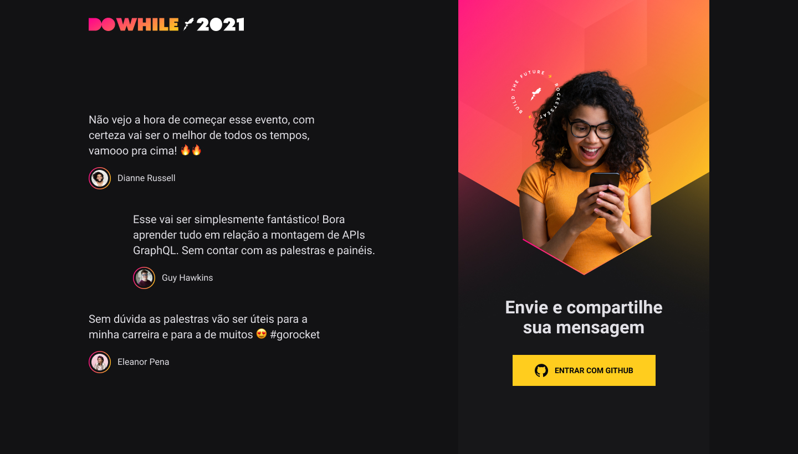
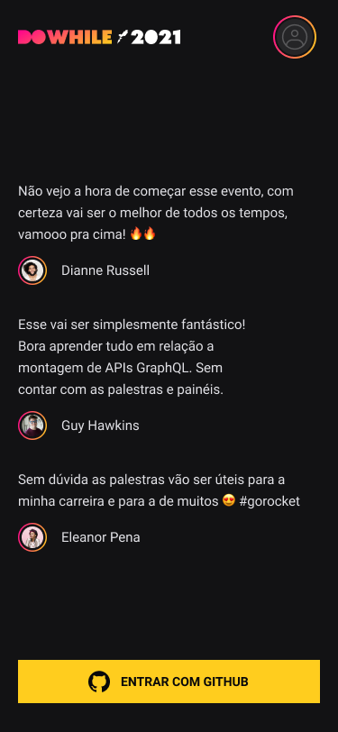

# Projeto NLW-HEAT

<a title="nlw-heat" >
    

        
    

</a>

  <a href="#Aula-REACT-JS">React</a>&nbsp;&nbsp;&nbsp;|&nbsp;&nbsp;&nbsp;
  <a href="#Aula-React-Native">React Native</a>&nbsp;&nbsp;&nbsp;|&nbsp;&nbsp;&nbsp;
  <a href="#Aula-NODE-JS">Node JS</a>&nbsp;&nbsp;&nbsp;|&nbsp;&nbsp;&nbsp;
  <a href="#Aula-Elixir">Elixir</a>&nbsp;&nbsp;&nbsp;|&nbsp;

O Projeto da **[Next Level Week](https://nextlevelweek.com/)** desta semana foi criar um sistema onde os usuarios podem dizer suas espectativas para o evento chamado DoWhile feito pela **[@Rocketseat](https://github.com/Rocketseat)**

<a href="https://github.com/DinowSauron/Projeto-Next-Level-Week-7-Heat" target="_blank">
    
    

        
        
        
    
  
</a>

## Tecnologias Utilizadas:

- Node JS
- Typescript
- React
- React Native
  - Expo cli
- Elixir
  - Phoenix
  - Postgres db
- Vite - (ts, jsx, css, webpack);
- Gihub Oauth
- Web Sockets
- Prisma

  
